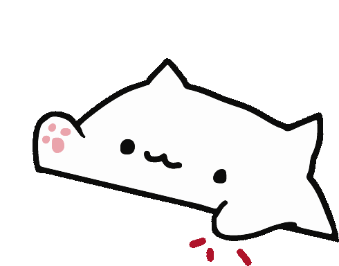

# The Yoink NewTab 🐱🥁

A premium, glassmorphism-inspired dashboard page featuring a sleek Catppuccin theme and a drumming Bongo Cat companion. Simply open the `catppuccin-newtab.html` file in your browser to use it!

## ✨ Features
- **Glassmorphism Design**: High-performance blur and transparency effects.
- **Dynamic Themes**: Customizable accent colors and background styles (Gradients, Waves, or Images).
- **Widgets**: Real-time Weather, Pomodoro/Stopwatch, and Task List.
- **Quick Access**: Pagination-supported shortcut manager with custom icons.
- **Fully Customizable**: Control border width, tile roundness, blur intensity, and more via a side settings pane.

## 🚀 Usage

Since this is a standalone HTML file rather than a packaged extension, you have a few ways to use it:

1. **Directly in Browser**: Double-click `catppuccin-newtab.html` to open it as a local file in any modern browser.
2. **As a Homepage**: Go to your browser settings and set the local file path as your homepage or startup page.
3. **With an Extension**: Use a "Custom New Tab" extension to point your new tabs directly to your local file path. 
   - **Chrome / Edge / Brave**: Use [Custom New Tab URL](https://chromewebstore.google.com/detail/custom-new-tab/lfjnnkckddkopjfgmbcpdiolnmfobflj).
   - **Firefox**: You can look for a similar add-on in the Firefox Add-ons store that allows overriding the new tab with a local URL.

## 🛠 Built With
- HTML5 / CSS3 (Vanilla)
- JavaScript (Vanilla)
- [OGL](https://github.com/oframe/ogl) (for background animations)
- Material Symbols Rounded

## 📄 License
Licensed under the Apache License 2.0. Feel free to fork and customize!
