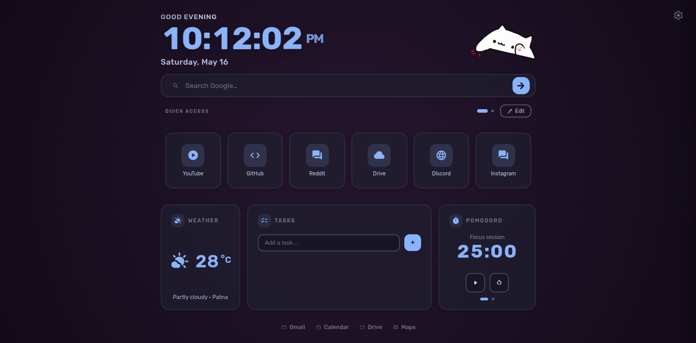
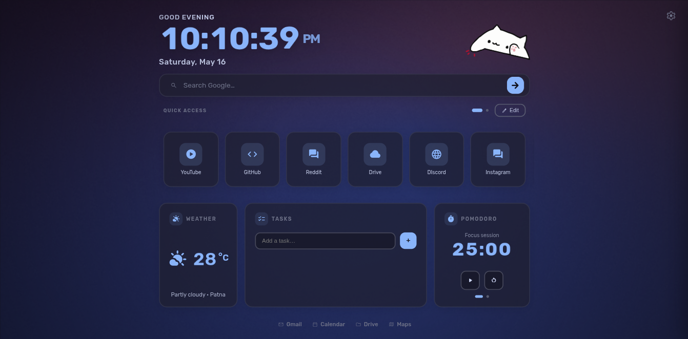
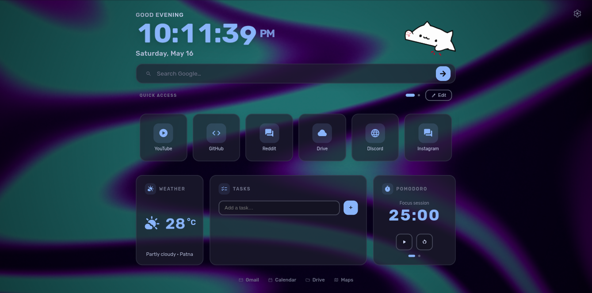
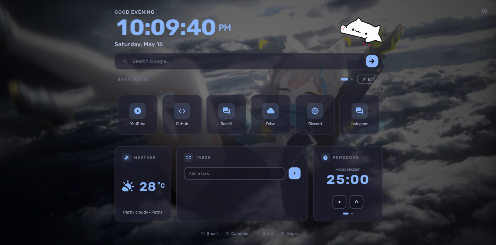

# Yoink NewTab 🎨

<p align="center">
  <a href="https://github.com/WatashiAD/Yoink-NewTab"></a>
  <a href="https://github.com/WatashiAD/Yoink-NewTab/network"></a>
  <a href="https://github.com/WatashiAD/Yoink-NewTab/blob/main/LICENSE"></a>
</p>

<p align="center">
  
</p>

<p align="center">
  <strong>A sleek, glassmorphism‑inspired new tab page with a drumming Bongo Cat companion.</strong><br/>
  Fully customizable · Catppuccin themed · Zero dependencies
</p>

---

## 📚 Table of Contents
- [✨ Features](#-features)
- [📸 Screenshots](#-screenshots)
- [🚀 Installation](#-installation)
- [⚙️ Customization](#-customization)
- [🛠️ Tech Stack](#-tech-stack)
- [📂 Project Structure](#-project-structure)
- [📄 License](#-license)

---

## ✨ Features

### 🎨 Design
- **Glassmorphism UI** — Frosted glass tiles with backdrop blur, subtle borders, and layered transparency
- **Catppuccin Dark Theme** — Curated palette for reduced eye strain
- **Responsive Layout** — Scales to any screen size without zooming
- **Smooth Animations** — Fade‑in, hover effects, and particle destruction on delete

### 📦 Widgets
- **🕒 Live Clock** — Flip‑style digits, 12/24 h toggle, optional seconds
- **🌤️ Weather** — Real‑time display with location and conditions
- **⏳ Pomodoro Timer** — Focus timer with customizable work/break intervals
- **⏱️ Stopwatch** — Lap tracking with start/stop/reset controls
- **✅ Task List** — Quick task manager with add/complete/delete

### 📌 Quick Access
- **🔗 Shortcut Manager** — Pin favorite sites with custom icons and colors
- **📑 Pagination** — Pill‑shaped dot navigation with mouse‑wheel and touch‑swipe support for smooth multi‑page browsing
- **🖊️ Edit Mode** — Reorder, edit, or remove shortcuts with a visual grid

---

## 📸 Screenshots

<table>
  <tr>
    <td align="center">
      <strong>Solid</strong><br/>
      
    </td>
    <td align="center">
      <strong>Gradient</strong><br/>
      
    </td>
  </tr>
  <tr>
    <td align="center">
      <strong>Wave Shader</strong><br/>
      
    </td>
    <td align="center">
      <strong>Media Wallpaper</strong><br/>
      
    </td>
  </tr>
</table>

---

## 🚀 Installation

### Quick Start
1. **Download** the [`index.html`](index.html) file.
2. **Open** it in any modern browser (Chrome, Firefox, Edge, Brave).

### Set as New Tab Page
Since browsers don’t natively support local files as new tabs, use one of these extensions:

| Browser | Extension |
|---------|-----------|
| Chrome / Edge / Brave | [Custom New Tab URL](https://chromewebstore.google.com/detail/custom-new-tab/lfjnnkckddkopjfgmbcpdiolnmfobflj) |
| Firefox | [Custom New Tab URL](https://addons.mozilla.org/en-US/firefox/addon/custom-new-tab-url/) |

Alternatively, set the file as your **homepage** or **startup page** in browser settings.

---

## ⚙️ Customization

Access the settings pane by clicking the **settings** icon in the top‑right corner.

| Setting | Description |
|---------|-------------|
| 🎨 **Accent Color** | Primary theme color for highlights and interactive elements |
| 🌀 **Blur Intensity** | Backdrop blur strength on glass tiles |
| ☀️ **Brightness** | Overall background brightness |
| 🌚 **Vignette** | Radial darkening around edges |
| 🔲 **Tile Roundness** | Border radius of all UI cards |
| 🧱 **Border Opacity** | Visibility of tile borders |
| 🖼️ **Background Style** | Solid color, gradient, wave shader, or custom image/video |
| ⏰ **24‑Hour Clock** | Toggle between 12h and 24h time format |
| ⏱️ **Show Seconds** | Toggle seconds display on the clock |
| 🌡️ **Weather Unit** | Celsius or Fahrenheit |

---

## 🛠️ Tech Stack
- **HTML5** — Semantic structure
- **CSS3** — Glassmorphism effects, animations, responsive design
- **Vanilla JavaScript** — Zero‑framework dependencies
- **WebGL** — Shader‑based animated backgrounds
- **IndexedDB** — Persistent video wallpaper storage via [localForage](https://github.com/localForage/localForage)
- **Material Symbols Rounded** — Icon set from Google Fonts

---

## 📂 Project Structure

```
Yoink-NewTab/
├── index.html              # Single‑file application (all HTML, CSS, JS)
├── bongo-cat.gif           # Animated header companion
├── screenshot-solid.png    # Solid background preview
├── screenshot-dynamic.png  # Gradient background preview
├── screenshot-wave.png     # Wave shader background preview
├── screenshot-media.png    # Media wallpaper preview
├── README.md               # Project documentation (this file)
├── LICENSE                 # Apache 2.0
└── .gitignore
```

---

## 📄 License
Licensed under the [Apache License 2.0](LICENSE).

Feel free to fork, modify, and make it yours.
